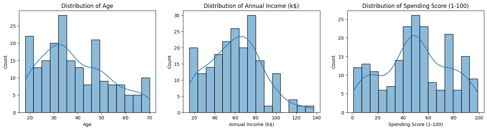
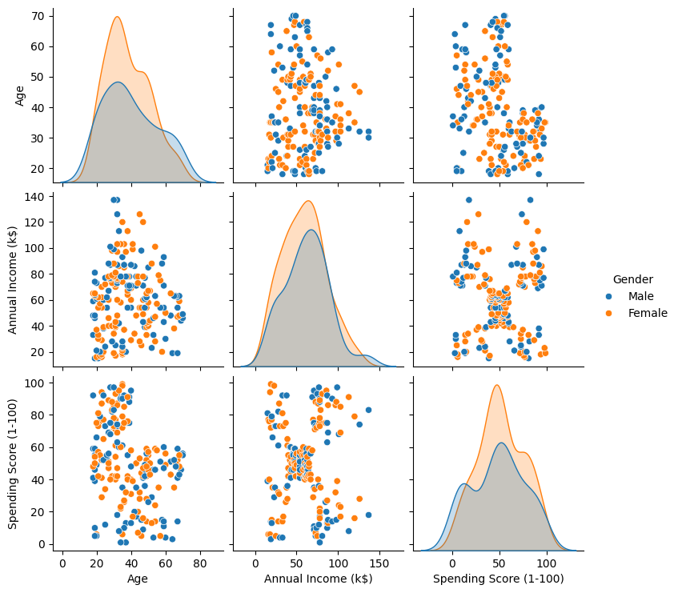
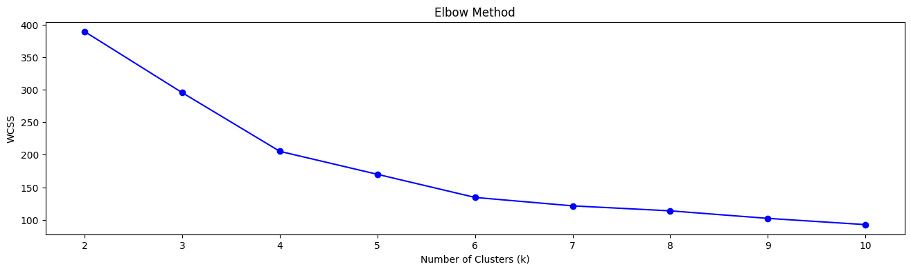
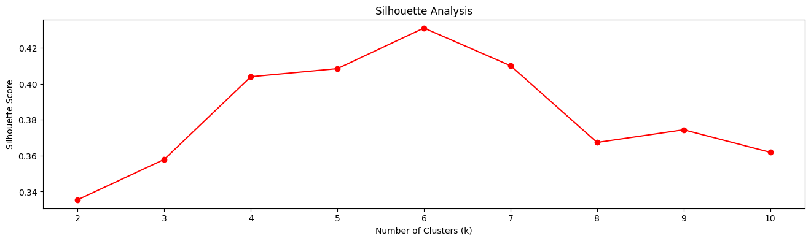
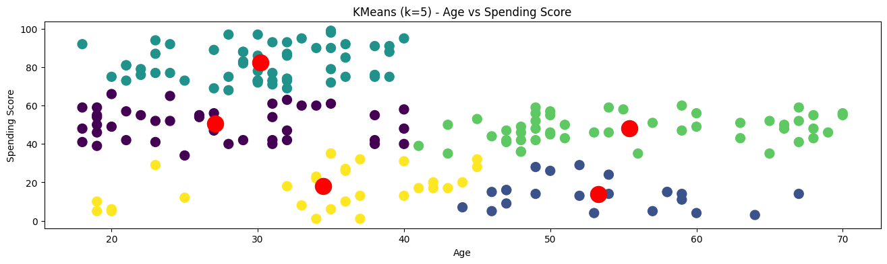
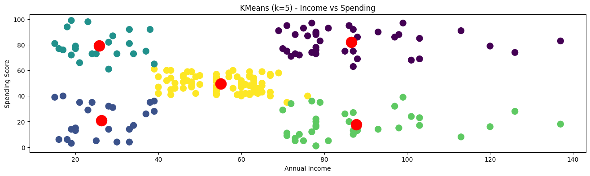
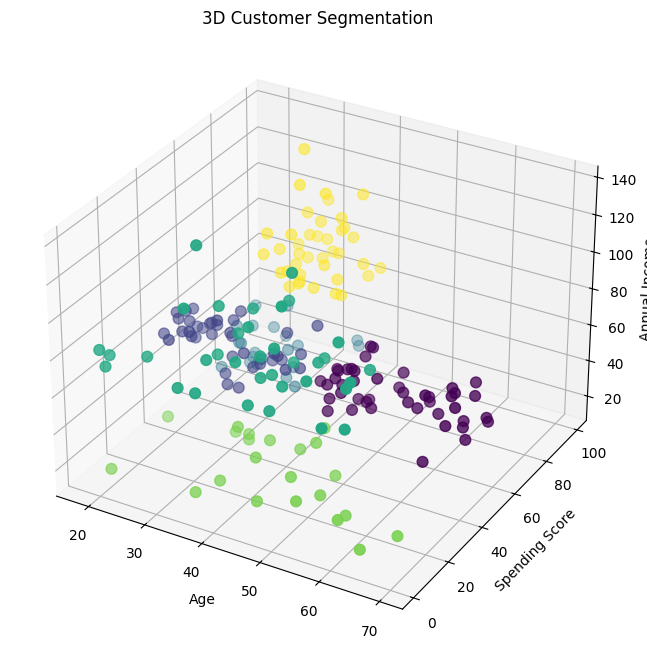

# 📊 Machine Learning Customer Segmentation Project

This project applies **K-Means Clustering**, an unsupervised machine learning algorithm, to segment mall customers based on their purchasing behavior.

---

## 📌 Problem Statement
Businesses need to understand customer behavior to design effective marketing strategies.  
This project groups customers into different segments based on:

- Age
- Annual Income
- Spending Score

---

## 📂 Dataset
**Mall Customers Dataset**  
Source: Kaggle  
Features:
- CustomerID
- Gender
- Age
- Annual Income (k$)
- Spending Score (1–100)

---

## ⚙️ Technologies Used
- Python
- Google Colab
- NumPy
- Pandas
- Matplotlib
- Seaborn
- Scikit-learn

---

## 🧠 Machine Learning Technique
- **K-Means Clustering**
- Feature Scaling using **StandardScaler**
- Optimal cluster selection using:
  - Elbow Method
  - Silhouette Score

---

## 📊 Project Visualizations

### 🔹 Data Distribution

### 🔹 PairPlot 

### 🔹 Elbow Method for Optimal Clusters

### 🔹 Silhouette Score Analysis

### 🔹 2D Customer Segmentation

### 🔹 2D Customer Segmentation

### 🔹 3D Customer Segmentation

---

## 📈 Visualizations
- Distribution plots
- Pair plots
- 2D clustering plots
- 3D customer segmentation

---

## 🚀 How to Run the Project
1. Clone the repository
2. Open the notebook in **Google Colab**
3. Run all cells sequentially

---

## 📌 Results
The model successfully segmented customers into meaningful clusters such as:
- High income – high spenders
- Low income – high spenders
- Low income – low spenders

These insights help businesses target customers effectively.

---

## 👤 Author
**Rohan Gaikwad**  
B.Tech AI & Data Science  
Sanjivani University
